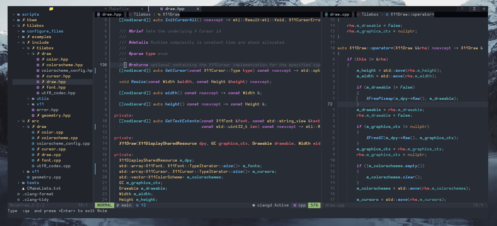

<div align="center">
  <h1>neovim.config</h1>
  
</div>
<br>
<div align="center">
  
  <br>
  <p>A modern <b>neovim</b> config  written in Lua for low level programmers</p>
</div>

## Table of Contents

- [Install](#install)
- [Usage](#usage)
- [Maintainers](#maintainers)
- [Contributing](#contributing)
- [License](#license)

## Install

1. Get Node/Npm: `curl -fsSL https://fnm.vercel.app/install | bash`
2. Get Rust: `curl --proto '=https' --tlsv1.2 -sSf https://sh.rustup.rs | sh`

### Ubuntu

1. Apt: `sudo apt install build-essential cmake python3-pip luarocks wl-clipboard python3.10-venv codespell clang-tools clang-format clangd bear`
2. Pip: `pip install pynvim cmake-format --user`
3. Npm: `npm install -g neovim`

### Neovim Config

There isn't much to install, just copy the `nvim` directory to `~/.config/nvim`.
But for the sake of commands..

```
# clone the repo to home
git clone --depth 1 https://github.com/thebashpotato/neovim.config.git ~/

# make a soft link to the config
ln -s $(pwd)/neovim.config/nvim ~/.config/nvim

# open nvim and let it set up
nvim
```

## Usage

See the [Dap configs](./dap-configs) for per-project language configurations.

## Maintainers

[@thebashpotato](https://github.com/thebashpotato)

## Contributing

PRs accepted.

Small note: If editing the README, please conform to the [standard-readme](https://github.com/RichardLitt/standard-readme) specification.

## License

AGPLv3 © 2022 Matt Williams
